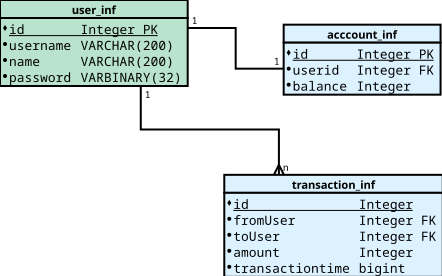

### Database Basics

#### so what is a database?

The Database term, is commonly used to signify all: a group of structured data stored in a computer, and a Database 
Management System together with the tools it provides.

There multiple different types of databases, the one we will explore on this course is a Relational Database.

#### Relational database representations:

One way to represent the database is to use a diagram, this diagram will display the tables (relations) that 
are part of the database and its columns (attributes) with their types (i.e. varchar)

For example (yearupSpring) our current Database would be represented as: 

:question: How can we improve it?

Note that the diagram only displays the structure of the database (Schema), our database will eventually also contain 
rows (tuple) of actual information.

The diagram does also include the relationships between tables, One to One, One to Many, Many to One.Many to Many.

[back](outline.md)